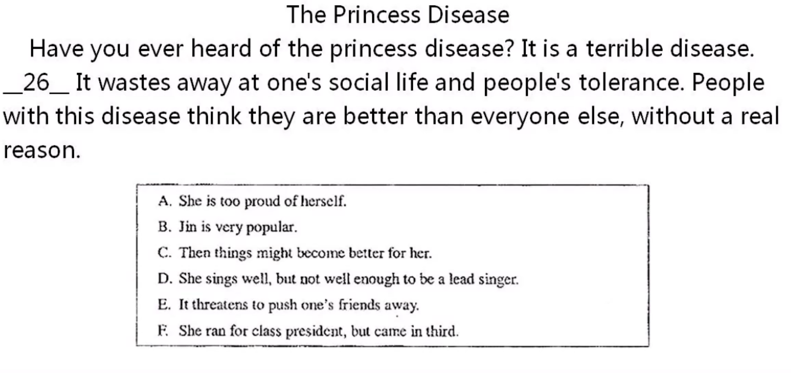
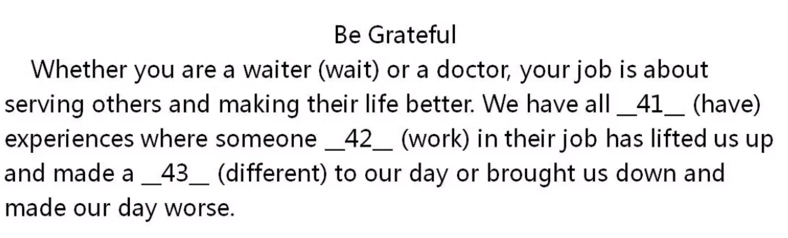
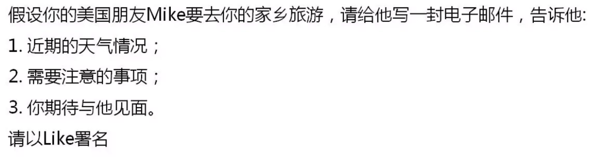
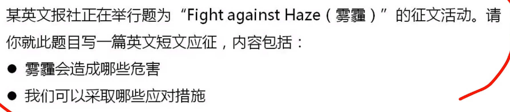
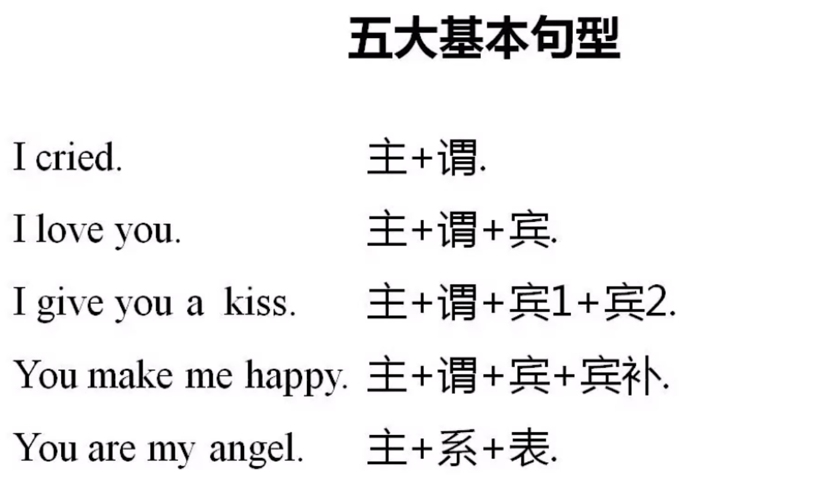

# 英语(二) 精讲

## 题型

1. ### 阅读判断

2. ### 阅读选择

   

3. ### 概括段落大意

   

4.  ### 补全句子

   

5. ### 填句补文

   

6. ###  补词填文

   

7. ### 完形补文

   

8. ### 短文写作

   

   

 

定语:修饰名词

状语:修改动作

# 精讲 1:36:12

